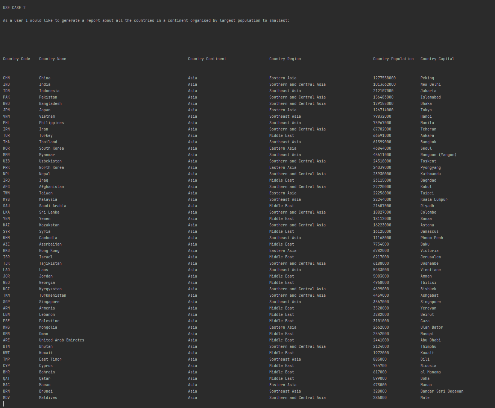

# SET08403 2020-1 TR2 001 - Software Engineering Methods || Group B || Coursework

---

- Master Build Status (Travis-ci):  
- Code coverage:                    

- Release Build Status (Travis-ci):   
- Code coverage:                    

- Develop Build Status (Travis-ci): 
- Code coverage:                    

- Licence:                          

- Release:                          

---

This is group B's coursework submission for SET08403 2020-1 TR2 001.

---

Evidence to show completion of objectives:

1. ID of the requirement.
2. Name of the requirement.
3. Has the requirement been met (Yes or No).
4. Screenshot.

PLEASE NOTE: We have identified:

    The population of the world.
    The population of a continent.
    The population of a region.
    The population of a country.
    The population of a district.
    The population of a city.

as one use case

but identified:

    Chinese.
    English.
    Hindi.
    Spanish.
    Arabic.

speakers as separate use cases rather than the other way around. 

As such we have 31 use cases in our project instead of 32. 
Thus use case 32 is failed as we didn't sort by the total speakers since we generated 
the reports separately

All functionality for all 32 is still present and presented still though, which I'll show below but it wont order
between the 5 as expected.

| ID    | Name | Met  | Screenshot |
|-------|------|------|------------|
| 1     | All the countries in the world organised by largest population to smallest.   | Yes |    |
| 2     | All the countries in a continent organised by largest population to smallest. | Yes |    |
| 3     | All the countries in a region organised by largest population to smallest.    | Yes |    |
| 4     | The top N populated countries in the world where N is provided by the user.   | Yes |    |
| 5     | The top N populated countries in a continent where N is provided by the user. | Yes |    |
| 6     | The top N populated countries in a region where N is provided by the user.    | Yes |    |
| 7     | All the cities in the world organised by largest population to smallest.      | Yes |    |
| 8     | All the cities in a continent organised by largest population to smallest.    | Yes |    |
| 9     | All the cities in a region organised by largest population to smallest.       | Yes |    |
| 10     | All the cities in a country organised by largest population to smallest.      | Yes |    |
| 11    | All the cities in a district organised by largest population to smallest.     | Yes |    |
| 12    | The top N populated cities in the world where N is provided by the user.      | Yes |    |
| 13    | The top N populated cities in a continent where N is provided by the user. | Yes |    |
| 14    | The top N populated cities in a region where N is provided by the user. | Yes |    |
| 15    | The top N populated cities in a country where N is provided by the user. | Yes |    |
| 16    | The top N populated cities in a district where N is provided by the user. | Yes |    |
| 17    | All the capital cities in the world organised by largest population to smallest. | Yes |    |
| 18    | All the capital cities in a continent organised by largest population to smallest. | Yes |    |
| 19    | All the capital cities in a region organised by largest to smallest. | Yes |    |
| 20    | The top N populated capital cities in the world where N is provided by the user. | Yes |    |
| 21    | The top N populated capital cities in a continent where N is provided by the user. | Yes |    |
| 22    | The top N populated capital cities in a region where N is provided by the user. | Yes |    |
| 23    | The population of people, people living in cities, and people not living in cities in each continent. | Yes |    |
| 24    | The population of people, people living in cities, and people not living in cities in each region. | Yes |    |
| 25    | The population of people, people living in cities, and people not living in cities in each country. | Yes |    |
| 26    | The population of the world. | Yes |    |
| 27    | The population of a continent. | Yes |    |
| 28    | The population of a region. | Yes |    |
| 29    | The population of a country. | Yes |    |
| 30    | The population of a district. | Yes |    |
| 31    | The population of a city. | Yes |    |
| 32    | Finally, the organisation has asked if it is possible to provide the number of people who speak the following the following languages from greatest number to smallest, including the percentage of the world population: Chinese, English, Hindi, Spanish, Arabic.| No |    |
---

This group consists of:
* Hilton, James - <B>40456918</b> - https://github.com/Jameshilton97
* Mccollum, Daniel - <b>40456785</b> - https://github.com/CastleRush6
* Mcmahon, Scott - <b>40343450</b> - https://github.com/40343450
* Munford, Andrew - <b>40456784</b> - https://github.com/AndyMunty

Work tracking done on  [zube.io](https://zube.io/napier-160/semcourseworkgroupb/w/workspace-1/sprints)

Group contribution is recorded here at the linked spreadsheet below as well as GitHub metrics and analytics.\
[Individual Assessment SET08103 Group B.xlsx](https://livenapierac-my.sharepoint.com/:x:/g/personal/40343450_live_napier_ac_uk/ETHVbPeqcMhHiCsw14ChuY8BfhRsbRodyyRdU4XGnFr9UA?e=k3oLJI)
---